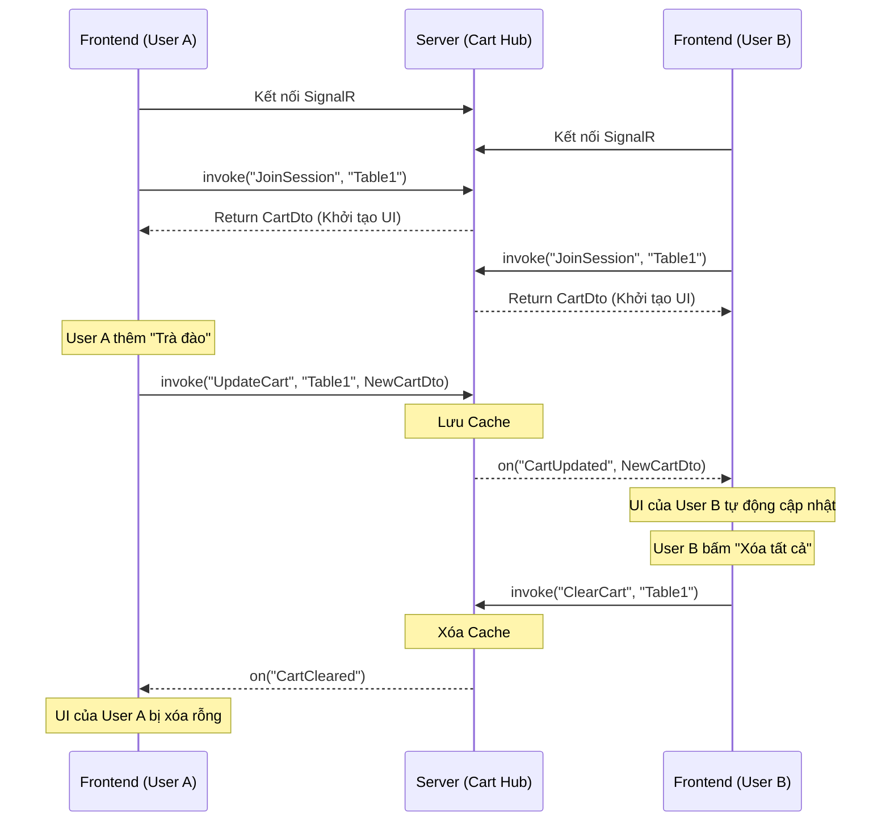

# Hướng dẫn Tích hợp SignalR: Giỏ Hàng Chung (Shared Cart Hub)

Tài liệu này mô tả cách Frontend (FE) kết nối và tương tác với SignalR Hub để triển khai tính năng **Giỏ hàng chung thời gian thực (Real-time Shared Cart)** cho một phiên quét mã QR tại bàn.

---

## 1. Thông tin Kết nối (Connection)

- **Endpoint (URL):** `<BASE_API_URL>/hubs/cart`
- **Giao thức:** WebSockets (thông qua SignalR)
- **Thư viện khuyến nghị cho FE:** `@microsoft/signalr`

### Ví dụ Khởi tạo kết nối (TypeScript):
```typescript
import * as signalR from "@microsoft/signalr";

const cartConnection = new signalR.HubConnectionBuilder()
    .withUrl("http://localhost:<PORT>/hubs/cart")
    .withAutomaticReconnect()
    .build();

// Bắt đầu kết nối
await cartConnection.start();
console.log("Connected to Cart Hub!");
```

---

## 2. Kiểu Dữ Liệu (Data Models)

Các interface FE cần định nghĩa để đồng bộ với Backend:

```typescript
export interface CartItemDto {
    menuItemId: string;         // Guid của món ăn
    menuItemName: string;       // Tên món ăn
    price: number;              // Đơn giá
    quantity: number;           // Số lượng
    specialRequest?: string;    // Yêu cầu đặc biệt (tùy chọn)
    imageUrl?: string;          // Ảnh món ăn (tùy chọn)
}

export interface CartDto {
    items: CartItemDto[];       // Danh sách các món trong giỏ
    totalAmount: number;        // Tổng tiền (BE tự tính dựa trên items)
}
```

---

## 3. Luồng Nghiệp Vụ (Workflow)

### Bước 1: Tham gia vào Phiên (Join Session)
Ngay sau khi kết nối SignalR thành công và người dùng đã quét mã QR thành công (biết được `sessionCode`), FE cần gọi hàm `JoinSession`.

- **Hub Method:** `JoinSession`
- **Tham số:** `sessionCode` (string)
- **Trả về (Returns):** `CartDto` (Trạng thái giỏ hàng hiện tại)
- **Mục đích:** Đưa người dùng vào "phòng" SignalR của bàn đó, đồng thời lấy dữ liệu giỏ hàng khởi tạo ban đầu để hiển thị lên UI.

```typescript
// Gọi từ FE -> BE
const currentCart: CartDto = await cartConnection.invoke("JoinSession", "SESSION_CODE_ABC123");
console.log("Giỏ hàng hiện tại của bàn:", currentCart);
// -> Cập nhật State giỏ hàng trên UI
```

### Bước 2: Lắng nghe sự thay đổi từ người khác (Listen for Updates)
FE cần đăng ký (subscribe) các sự kiện từ Server trả về để cập nhật UI theo thời gian thực khi những người khác trong cùng bàn thực hiện thao tác.

- **Sự kiện 1: `CartUpdated`**
  - **Dữ liệu nhận được:** `CartDto` (Giỏ hàng mới nhất)
  - **Mục đích:** Bất cứ khi nào một người ở cùng bàn thêm/sửa/xóa món, BE sẽ gửi sự kiện này kèm giỏ hàng mới để FE của bạn tự cập nhật lại UI.
  
- **Sự kiện 2: `CartCleared`**
  - **Dữ liệu nhận được:** Không có
  - **Mục đích:** Khi giỏ hàng bị làm sạch (ví dụ: đã đặt món xong, hoặc ai đó bấm xóa tất cả). FE cần reset giỏ hàng về rỗng.

```typescript
// Lắng nghe từ BE -> FE
cartConnection.on("CartUpdated", (updatedCart: CartDto) => {
    console.log("Có người vừa cập nhật giỏ hàng:", updatedCart);
    // -> Cập nhật lại State/UI giỏ hàng
});

cartConnection.on("CartCleared", () => {
    console.log("Giỏ hàng đã bị xóa!");
    // -> Reset State giỏ hàng về rỗng
});
```

### Bước 3: Thay đổi giỏ hàng (Update Cart)
Mỗi khi người dùng hiện tại có hành động thay đổi giỏ hàng (Thêm món mới, Tăng/giảm số lượng, Xóa món, Thêm ghi chú), FE sẽ **tự cập nhật State ở Client**, sau đó gửi **toàn bộ object Giỏ hàng mới nhất** lên Server.

- **Hub Method:** `UpdateCart`
- **Tham số:** 
  1. `sessionCode` (string)
  2. `cart` (CartDto)
- **Lưu ý:** Hàm này sẽ Cập nhật cache trên Server VÀ tự động trigger sự kiện `CartUpdated` cho **TẤT CẢ NHỮNG NGƯỜI KHÁC** ở cùng bàn (ngoại trừ người gọi).

```typescript
// Giả sử user vừa thêm 1 món vào giỏ (tự tính toán items mới trên Client)
const updatedCartState: CartDto = {
    items: [ ... ],
    totalAmount: 100000 
};

// Gửi toàn bộ giỏ hàng mới lên Server (FE -> BE)
await cartConnection.invoke("UpdateCart", "SESSION_CODE_ABC123", updatedCartState);
```

### Bước 4: Làm sạch giỏ hàng (Clear Cart)
Nếu có nút "Xóa tất cả", hoặc sau khi đã Submit Order thành công, FE có thể gọi hàm xóa.

- **Hub Method:** `ClearCart`
- **Tham số:** `sessionCode` (string)
- **Lưu ý:** Kích hoạt sự kiện `CartCleared` cho tất cả người khác.

```typescript
// Gọi từ FE -> BE
await cartConnection.invoke("ClearCart", "SESSION_CODE_ABC123");
```

### Bước 5: Rời phiên (Leave Session)
Khi người dùng đóng app hoặc rời khỏi bàn, nên gọi hàm rời khỏi phòng để tránh nhận thêm thông báo.

- **Hub Method:** `LeaveSession`
- **Tham số:** `sessionCode` (string)

```typescript
await cartConnection.invoke("LeaveSession", "SESSION_CODE_ABC123");
```

---

## 4. Tóm Tắt Quy Trình Hoạt Động (Mermaid)


